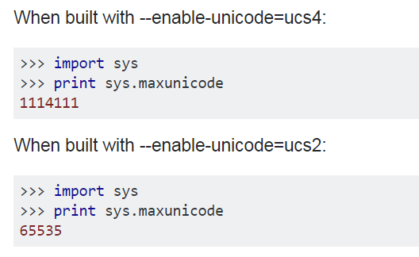
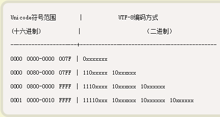

了解bytes, str与unicode的区别
====================================
effective python, 第3条

ASCII
---------
ASCII码是单字节定长编码，一共规定了128个字符的编码，只占用了一个字节的后面7位，最前面的一位统一规定为0。

UCS
-------
通用字符集（Universal Character Set）

Unicode标准的 2 字节形式通常称作 UCS-2。

Unicode 的 4 字节形式被称为 UCS-4 或 UTF-32，能够定义 Unicode 的全部扩展，最多可定义 100 万个以上唯一字符。

Unicode
------------

Unicode 字符编码标准是固定长度的字符编码方案，它包含了世界上几乎所有现用语言的字符。缺省编码格式是 16 位，即每个字符是 16 位（两个字节，UCS-2 ）宽，并且通常显示为 U+hhhh，其中 hhhh 是字符的十六进制代码点，即可以表示不多于65536种字符。

find out if Python is compiled with UCS-2 or UCS-4
^^^^^^^^^^^^^^^^^^^^^^^^^^^^^^^^^^^^^^^^^^^^^^^^^^^^^^^^^^

在我的笔记本的64bit anaconda with python3.6，查得是UCS-4。

UTF-8
--------
Unicode转换格式（Unicode Transformation Format，简称为UTF）

UTF-8是一种算法变换，它将定长 Unicode 字符变换为变长 ASCII 安全的字节字符串。在 UTF-8 中，ASCII 和控制字符 由通常的单字节代码表示，但其他字符变为双字节或更多字节。有下图可得，用utf8处理汉字，反而更费空间。

+------+------------------+------------------+
|      | unicode          | utf8             |
+------+------------------+------------------+
| 汉字 | 范围是4E00到9FA5 | 由三个字节来组织 |
+------+------------------+------------------+

解读utf8的优势
^^^^^^^^^^^^^^^^^^
utf8虽然是变长编码，但是字符占用的字节数就包含在编码本身（见下一小节）。在告知一个字符串是utf8编码的前提下，可以轻松界定出串中字符的边界，而无需被到底哪几个字节是一个字符而困扰。

unicode转utf8
-----------------
utf8的转码规则就是不同范围的unicode对应着相应的编码方式，见下图，下图中，unicode使用的是4字节。解读 UTF-8 编码非常简单。如果一个字节的第一位是0，则这个字节单独就是一个字符；如果第一位是1，则连续有多少个1，就表示utf8编码后的当前字符占用多少个字节。

下面，还是以汉字严为例，演示如何实现 UTF-8 编码。

严的 Unicode 是4E25（100111000100101），根据上表，可以发现4E25处在第三行的范围内（0000 0800 - 0000 FFFF），因此严的 UTF-8 编码需要三个字节，即格式是1110xxxx 10xxxxxx 10xxxxxx。然后，从严的最后一个二进制位开始，依次从后向前填入格式中的x，多出的位补0。这样就得到了，严的 UTF-8 编码是11100100 10111000 10100101，转换成十六进制就是E4B8A5。

Little endian 和 Big endian
-------------------------------

上一节已经提到，UCS-2 格式可以存储 Unicode 码（码点不超过0xFFFF）。以汉字“严”为例，Unicode 码是4E25，需要用两个字节存储，一个字节是4E，另一个字节是25。存储的时候，4E在前，25在后，这就是 Big endian 方式；25在前，4E在后，这是 Little endian 方式。

第一个字节在前，就是"大头方式"（Big endian），第二个字节在前就是"小头方式"（Little endian）。

那么很自然的，就会出现一个问题：计算机怎么知道某一个文件到底采用哪一种方式编码？

Unicode 规范定义，每一个文件的最前面分别加入一个表示编码顺序的字符，这个字符的名字叫做"零宽度非换行空格"（zero width no-break space），用FEFF表示。这正好是两个字节，而且FF比FE大1。

如果一个文本文件的头两个字节是FE FF，就表示该文件采用大头方式；如果头两个字节是FF FE，就表示该文件采用小头方式。

bytes和str在python3中是什么
----------------------------
bytes和str都是python3的“class对象”，<class 'str'>，<class 'bytes'>，是两种表示字符序列的类型。

str类型的实例采用unicode编码，除此之外，无论采用utf8或其他编码形式，甚至不编码的字符序列都是bytes类型的实例。bytes类型并不记录实例的编码格式，只是单纯把字符序列的一个字节作为处理单元。这一点，通过len()可以看出：

.. code-block:: python
    :linenos:

    >>> s1 = "我"
    >>> type(s1)
    <class 'str'>
    >>> s2 = s1.encode('utf-8')
    >>> type(s2)
    <class 'bytes'>
    >>> s3 = s1.encode("big5")
    >>> type(s3)
    <class 'bytes'>
    >>> len(s2) #utf8以3字节编码汉字，而bytes类型以1个字节作为item
    3
    >>> len(s3) #big5以2字节编码汉字，而bytes类型以1个字节作为item
    2
    >>> len(s1) #本机器中，unicode以4字节编码汉字，这4个字节是一个item
    1

创建str实例
-------------
在python3中，用引号包括起来的字符序列，无论是中文，还是英文，都以unicode来编码

.. code-block:: python
    :linenos:

    >>> s1 = "我"
    >>> type(s1)
    <class 'str'>
    >>> s5 = 'hehe'
    >>> type(s5)
    <class 'str'>

创建bytes实例
----------------
在python3中，如果字符序列包含非英文字母，只能由str实例encode而来；如果只包含ascii中的字符，可以用b''

.. code-block:: python
    :linenos:

    >>> s1 = "我"
    >>> type(s1)
    <class 'str'>
    >>> s2 = s1.encode('utf-8')
    >>> type(s2)
    <class 'bytes'>
    >>> s1
    '我'
    >>> s2  
    b'\xe6\x88\x91'  #b表示bytes，\x表示16进制，因为e6超出ascii的范围，所以只能如此显示.
                     #为什么不显示成b'我'？python不会存储bytes实例对象的编码类型，就不会把
                     #这3个字节当成“我”的utf-8编码而合起来考虑。
    >>> s4 = b'hehe'
    >>> type(s4)
    <class 'bytes'>
    >>> s4
    b'hehe'          #ascii范围内的编码可以显示对应的字符，所以不会显示成b'\x..\x..'
    

python2字符序列的源码剖析
-----------------------------
在PyStringObject的类型对象PyString_Type中，tp_itemsize指明了由变长对象保存的元素（item）的单位长度，所谓单位长度就是指一个元素在内存中的长度（字节数）。

在python3中，str类型默认单位长度是4，而bytes类型的是1。

bytes实例和str实例的转化
-----------------------------

bytes实例和str实例之间的转化无需借助外部函数。

- bytes实例转化为str实例的方法就定义在bytes类型对象中，decode()，任何bytes实例都可以调用这个方法，但是，bytes的编码格式必须要事先知道，因为它要以参数传入decode()。
- str类型对象中的方法，encode(), 可以使str实例转化为bytes实例。

.. _detect-codec:

识别bytes的编码
--------------------
python3把除了unicode之外的所有编码作为bytes实例对象，使用chardet module就可以识别bytes到底是哪一种编码了, `how to use chardet <https://www.liaoxuefeng.com/wiki/0014316089557264a6b348958f449949df42a6d3a2e542c000/001510905171877ca6fdf08614e446e835ea5d9bce75cf5000>`_

注意，传入chardet.detect()必须是bytes，而不能是str

python3文件操作中的编码问题
-----------------------------

核心问题
^^^^^^^^^^^^^^
如何在不知道硬盘文件编码（unicode,utf8,gbk...）的情况下，安全的读/写文件。

python3在open()的encoding参数
^^^^^^^^^^^^^^^^^^^^^^^^^^^^^^^^^^^^^^^
.. code-block:: python
    :linenos:

    open(file, mode='r', buffering=-1, encoding=None, errors=None, newline=None, closefd=True, opener=None)

上面是open()的声明，参数encoding的意义是，

- 当读文件时，认为文件中字符序列所采用的编码方式；
- 写文件时，要把字符序列转换成所设置的编码格式后在写入。

The default **encoding** is platform dependent (whatever locale.getpreferredencoding() returns)，在本机，见下述代码：

.. code-block:: python
    :linenos:

    >>> import  locale
    >>> locale.getpreferredencoding()
    'cp936'  #就是GBK

以utf-8编码格式保存了一个.txt，如果以默认的encoding参数打开，在read()时就报错，代码如下

.. code-block:: python
    :linenos:

    >>> f = open('D:\\temp\\p3\\utf8.txt', 'r')
    >>> f.read()
    Traceback (most recent call last):
      File "<stdin>", line 1, in <module>
    UnicodeDecodeError: 'gbk' codec can't decode byte 0x86 in position 14: incomplet
    e multibyte sequence
    >>> f = open('D:\\temp\\p3\\utf8.txt', 'r',encoding='utf-8')
    >>> print(f.read()) #f.read()返回的是str对象
    我想你了