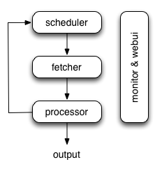

Pyspider
===========
pyspider的安装和启动
-------------------------
一、架构
pyspider的架构主要分为 scheduler（调度器）, fetcher（抓取器）, processor（脚本执行）：

- 各个组件间使用消息队列连接，除了scheduler是单点的，fetcher 和 processor 都是可以多实例分布式部署的。 scheduler 负责整体的调度控制

- 任务由 scheduler 发起调度，fetcher 抓取网页内容， processor 执行预先编写的python脚本，输出结果或产生新的提链任务（发往 scheduler），形成闭环。

- 每个脚本可以灵活使用各种python库对页面进行解析，使用框架API控制下一步抓取动作，通过设置回调控制解析动作。

二、安装

1、安装辅助包

.. code-block:: none
    :linenos:

    $sudo apt-get install python python-dev python-distribute python-pip \ libcurl4-openssl-dev libxml2-dev libxslt1-dev python-lxml

2、phantomjs

.. code-block:: none
    :linenos:

    $cd /usr/local/share
    $sudo wget https://phantomjs.googlecode.com/files/phantomjs-1.9.0-linux-x86_64.tar.bz2
    $sudo tar xjf phantomjs-1.9.0-linux-x86_64.tar.bz2
    $sudo ln -s /usr/local/share/phantomjs-1.9.0-linux-x86_64/bin/phantomjs /usr/local/bin/phantomjs
    $sudo ln -s /usr/local/share/phantomjs-1.9.0-linux-x86_64/bin/phantomjs /usr/bin/phantomjs
    $phantomjs -v

3、安装pyspider

.. code-block:: none
    :linenos:

    $sudo apt-get install libssl-dev #否则，会保持fatal error: openssl/crypto.h: No such file or directory，找不到头文件
    $pip install pyspider
    $sudo ln -s /home/apdep/.local/bin/pyspider  /usr/bin/pyspider  #这样才能在cmd中直接执行pyspider

4、查看安装路径：

.. code-block:: none
    :linenos:

    $ pip show --files pyspider
    Location: /home/apdep/.local/lib/python2.7/site-packages
                   /home/apdep/.local/bin/pyspider

三、运行pyspider

1. 

.. code-block:: none

    $~/.local/bin/pyspider   #默认执行$pyspider all，此时，所有组件以subprocess的形式运行;而在分布式部署时，one component in one process

运行此命令后显示：

Web server running on port 25555
webui running on 0.0.0.0:5000

2、访问web ui
visit http://localhost:5000/

3、查看帮助
$pyspider --help

pyspider的webUI创建爬虫
------------------------------
一、参考链接

http://cuiqingcai.com/2652.html

二、要点

1、webUI界面功能介绍
2、可以在on_start()中建立多个crawl base url

找出是哪个js代码请求了数据
----------------------------
场景： 用pyspider抓取网页时，如果网页中有的数据是通过AJAX请求的，那么如果不执行这些js，页面中出现空白。但是，有那么多js，到底是哪个js请求了我们需要的数据呢？

答案：http://docs.pyspider.org/en/latest/tutorial/AJAX-and-more-HTTP/#ajax

HTTP 599 error
-------------------
 在抓取澳大利亚人报的category时，pyspider报了如下的错误：

HTTPError: HTTP 599: Maximum (5) redirects followed

    显示这个错误的源代码在如下链接：

https://github.com/binux/pyspider/blob/master/pyspider/fetcher/tornado_fetcher.py

从源代码中我们可以看出在连续收到了5次的，(301, 302, 303, 307)后，就会报这个错

webUI加载太慢
-----------------
F12发现是cdn加载不了，这个问题以前也有人遇到过，作者已经给出了答案

.. code-block:: none
    :linenos:

    {
      "webui": {
        "cdn": "//cdnjs.cloudflare.com/ajax/libs/"
      }
    }

从命令行启动pyspider
------------------------
官方文档：http://docs.pyspider.org/en/latest/Command-Line/

一、总命令

.. code-block:: none

    $pyspider [OPTIONS] COMMAND [ARGS]
         [OPTIONS] :global options work for all subcommands.
         COMMAND: all, one,  bench, scheduler, phantomjs, fetcher, processor,  result_worker, webui,
         [ARGS]: 针对每个COMMAND，没有不同参数

二、逐个component启动

1、fetcher

当要和phantomjs配合使用时，启动fetcher的命令是：
$pyspider --phantomjs-proxy="localhost:25555" fetcher
（参考：http://docs.pyspider.org/en/latest/Deployment/）

2、bench

    projectdb, taskdb, resultdb虽然使用了默认的sqlite，但是，数据库文件还是要存盘的，不然状态无法保存。
    除非Run Benchmark test. In bench mode, in-memory sqlite database is used instead of on-disk sqlite database.

pyspider的分布式部署
-----------------------
http://docs.pyspider.org/en/latest/Deployment/

核心思想：用command line在不同的机器上起动不同的component