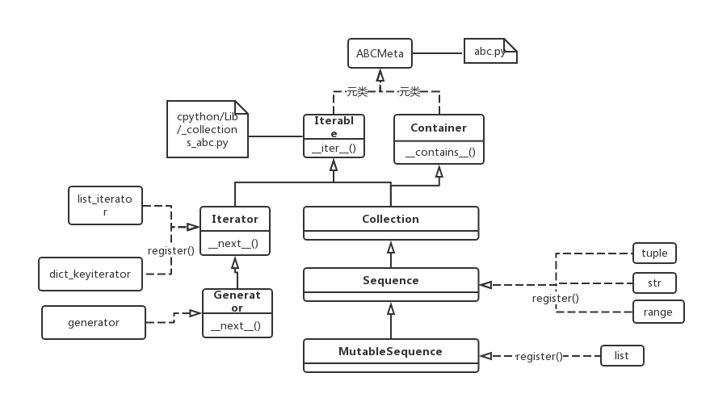

Generator
============
Reference
--------------
学习generator时主要参考了两个链接：

- `python生成器的优点-zhihu <https://www.zhihu.com/question/24807364>`_
- `Python Generators <https://www.programiz.com/python-programming/generator>`_

python3源码
--------------------

1. python3中确实有内建的class generator
2. class Generator继承自class Iterator，所以class generator的实例对象可以直接作为next()参数，而无必要先调用iter()；当然，generator实例也可用于"for loop"

How to define a generator
------------------------------

Generator functions
^^^^^^^^^^^^^^^^^^^^^^^^
1. If a function contains at least one `yield expression <https://docs.python.org/3.6/reference/expressions.html#yield-expressions>`_ (it may contain other yield or return statements), it becomes a generator function. 无论是有多个yield()语句，还是在for loop中调用yield()，例如 `reverse the string <https://www.programiz.com/python-programming/generator#with-loop>`_.

    yield和return的区别, while a return statement terminates a function entirely, yield statement pauses the function saving all its states and later continues from there on successive calls.

2. When a generator function is called, it returns an iterator known as **a generator**, 此时，不执行函数体中的任何语句。
3. 第一次执行“next(the-generator)”时，从"the generator function"的函数体的第一行开始，直至“第一条yield expression”为止，此时，returning the value of **expression_list** to the generator’s caller

    但是注意啦，The value of **the yield expression** after resuming depends on the method which resumed the execution. If __next__() is used (typically via either a for or the next() builtin) then the result is None. Otherwise, if send() is used, then the result will be the value passed in to that method. 这一段的理解有点困难，示例代码可以参见 `Code Examples <https://docs.python.org/3.6/reference/expressions.html#examples>`_, 我对这段代码的理解如下：

        - 客户端代码第1次调用next(generator)时，并未执行value = (yield value)，而是停在了右侧的"yield expression"，把value的值1返回给了next(generator)，作为print()的参数打印了出来
        - 客户端代码第2次调用next(generator)时，value = (yield value) 才被执行，而(yield value)的值是None，所以在给value赋完新值None后，程序又停在了value = (yield value)右侧的(yield value)，把value的值None返回给了next(generator)用于print()

.. code-block:: python
	:linenos:

	# A simple generator function
	def my_gen():
	    n = 1
	    print('This is printed first')
	    # Generator function contains yield statements
	    yield n

	    n += 1
	    print('This is printed second')
	    yield n

	    n += 1
	    print('This is printed at last')
	    yield n

客户端代码如下：

1. 使用next() 

.. code-block:: python
	:linenos:

	# It returns an iterator object but does not start execution immediately.
	>>> a = my_gen()

	# We can iterate through the items using next().
	# 代码从第3行开始执行至第一个yield语句, the function is paused and the control is transferred to the caller.
	#yield后表达式的值被返回给caller
	>>> next(a)
	This is printed first
	1

	# Local variables and theirs states are remembered between successive calls.
	# my_gen()从上次挂起的地方继续执行至第二个yield语句
	>>> next(a)
	This is printed second
	2

	>>> next(a)
	This is printed at last
	3

	# Finally, when the function terminates, StopIteration is raised automatically on further calls.
	>>> next(a)
	Traceback (most recent call last):
	...
	StopIteration
	>>> next(a)
	Traceback (most recent call last):
	...
	StopIteration

2. 使用for loop

.. code-block:: none
	:linenos:

	# my_gen() return an iterable iterator
	# item就是my_gen()中每一条yield语句后表达式的值
	for item in my_gen():
	    print(item)
	#输出如下
	This is printed first
	1
	This is printed second
	2
	This is printed at last
	3    

Generator expressions
^^^^^^^^^^^^^^^^^^^^^^^^^^^

.. code-block:: python
	:linenos:

	>>> ge = (x**2 for x in [1,2,3])
	>>> ge
	<generator object <genexpr> at 0x00000000024B8AF0>
	>>> type(ge)
	<class 'generator'>

1. generator expression creates an anonymous generator function.   
    - generator expression返回的直接就是一个generator，而无需像generator function要调用后才会返回一个generator 
    - 上述示例代码中的"x**2"就是generator function中的"expression_list of yield"，即调用next(ge)后的返回值
    - 每调用一次next(ge)时的执行过程也和generator function相同——从上一条yield的下一条语句执行到下一条yield语句之前。
 
2. 和“列表推导式”的区别在于——using round parentheses.

Pipelining Generators
-------------------------------------------
Pipelining Generators的意思就是把多个generator串联起来。

Suppose we have a log file from a famous fast food chain. The log file has a column (4th column) that keeps track of the number of pizza sold every hour and we want to sum it to find the total pizzas sold in 5 years.
`示例代码 <https://www.programiz.com/python-programming/generator#use>`_ 有一些不足，我给出了完善

.. code-block:: python
	:linenos:
    
	#始终用'b'打开文件
	with open('sells.log', 'rb') as fp:
	    #读取非空行
	    pizza_col = (line.split(b' ')[3:4] for line in fp if line.strip())
	    per_hour = (int(x) for x in pizza_col if x != 'N/A')
	    #sum(iterable)
	    print("Total pizzas sold = ",sum(per_hour))

Attention
------------------------------
生成器只能遍历一次