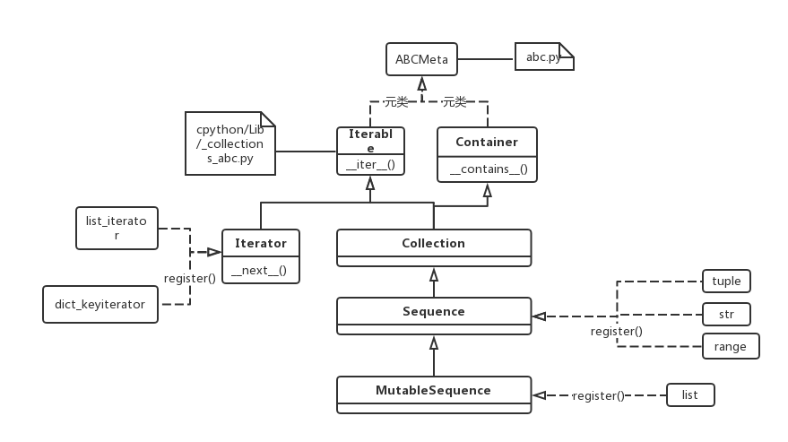

Iterator(迭代器)
=================
Reference
-----------------
https://www.programiz.com/python-programming/iterator

迭代器模式
-----------------
iterator是一种“设计模式”，和“观察者模式”、“访问者模式”同属于“面向任务的模式”，用于“执行及描述任务”。其目的是"提供一种方法访问一个容器对象中各个元素，而又不暴露该对象的内部细节。"

从上面的类关系图可得：

1. 容器类应该提供一个方法，可以得到其迭代器，在python中是Iterable.__iter__()
2. 然而，迭代器也应该提供一个方法，可以让“client程序”访问到容器类中的元素，在python中是Iterator.__next__()
3. 一般来说，我们只要实现一个集合，就需要同时提供这个集合的迭代器

python3的源码分析
-----------------------

1. python3用class Iterable和class Iterator两个抽象基类（ABC,abstract base class）定义了在其继承体系中的iterable类必须要实现的接口函数__iter__()以及iterator类必须要实现的__next__(),也就是所谓的“迭代协议”

.. code-block:: python
	:linenos:

	class Iterable(metaclass=ABCMeta):

	    __slots__ = ()

	    @abstractmethod
	    def __iter__(self):
	        while False:
	            yield None

	    @classmethod
	    def __subclasshook__(cls, C):
	        if cls is Iterable:
	            return _check_methods(C, "__iter__")
	        return NotImplemented

	class Iterator(Iterable):

	    __slots__ = ()

	    @abstractmethod
	    def __next__(self):
	        'Return the next item from the iterator. When exhausted, raise StopIteration'
	        raise StopIteration

	    def __iter__(self):
	        return self

	    @classmethod
	    def __subclasshook__(cls, C):
	        if cls is Iterator:
	            return _check_methods(C, '__iter__', '__next__')
	        return NotImplemented

2. python3 built-in **iterable type** and corresponding **iterator**, e.g. list and list_iterator

Built-in functions using iterable 
^^^^^^^^^^^^^^^^^^^^^^^^^^^^^^^^^^^^^^^
python很多内建的函数的参数都是iterable，例如

- sum(iterable[, start])
- max(iterable, \*iterables[,key, default])
- for element in iterable
- iter(iterable), return an iterator

Built-in iterable containers
^^^^^^^^^^^^^^^^^^^^^^^^^^^^^^^^
Most of built-in containers in Python like: list, tuple, string etc. are iterables.

.. code-block:: none
	:linenos:

	>>> x = [42,23,24]
	#从可迭代(iterable)对象中获取iterator
	#iter() in turn calls the __iter__() method
	>>> it = iter(x)
	>>> type(it)
	<class 'list_iterator'>
	>>> type(x)
	<class 'list'>
	#We use the next(), which in turn calls the __iter__() method, to manually iterate through all the items of an iterator. 
	#When we reach the end and there is no more data to be returned, it will raise StopIteration. 
	>>> next(it)
	42
	#next(obj) is same as obj.__next__()
	>>> it.__next__()
	23
	#built-in iterable container不能被next()直接调用
	>>> next(x)
	Traceback (most recent call last):
	  File "<stdin>", line 1, in <module>
	TypeError: 'list' object is not an iterator

Building Your Own Iterator
--------------------------------------------
custom class: the OO way
^^^^^^^^^^^^^^^^^^^^^^^^^^^
.. code-block:: python
	:linenos:

	class PowTwo:
	    """Class to implement an iterator
	    of powers of two"""

	    def __init__(self, max = 0):
	        self.max = max

	    def __iter__(self):
	        self.n = 0
	        return self

	    def __next__(self):
	        #自定义class一定要有这条件语句，用来终止next()
	        if self.n <= self.max:
	            result = 2 ** self.n
	            self.n += 1
	            return result
	        else:
	            #表示next()要终止
	            raise StopIteration

1. class定义了__iter__()表示其instance是iterable
2. 定义了__next__()表示其instance是iterator
3. 客户端代码如下

.. code-block:: python
	:linenos:

	>>> a = PowTwo(4)
	>>> i = iter(a)
	>>> next(i)
	1
	>>> next(i)
	2
	>>> next(i)
	4
	>>> next(i)
	8
	>>> next(i)
	16
	>>> next(i)
	Traceback (most recent call last):
	...
	StopIteration

或者

.. code-block:: python
	:linenos:

	>>> for i in PowTwo(5):
	...     print(i)
	...     
	1
	2
	4
	8
	16
	32

Generator functions
^^^^^^^^^^^^^^^^^^^^^^^
Generator expressions
^^^^^^^^^^^^^^^^^^^^^^^^^

How "for loop" actually works
--------------------------------
下面的代码中最重要的几点就是 

- iterable才能用到for语句中去
- **element == next(iter_obj)**

.. code-block:: none
	:linenos:

	for element in iterable:
	    # do something with element
	    pass

Is actually implemented as

.. code-block:: none
	:linenos:

	# create an iterator object from that iterable
	iter_obj = iter(iterable)
	# infinite loop
	while True:
	    try:
	        # get the next item
	        element = next(iter_obj)
	        # do something with element
	        pass
	    except StopIteration:
	        # if StopIteration is raised, break from loop
	        break

Why using iterator
---------------------------
iterator其实和定义一个函数以实现一个功能是相同的，为啥不定义一个函数算了呢？

- 设计模式中，惯用的伎俩就是把操作外化为类
- 语言提供统一的调用接口，iter(), next()