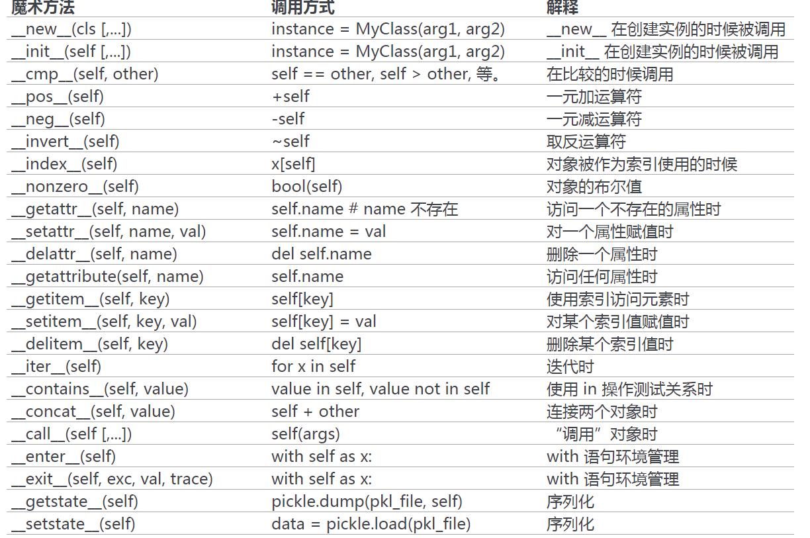

python的魔术方法
=================
Reference Link
^^^^^^^^^^^^^^^^^
http://pycoders-weekly-chinese.readthedocs.io/en/latest/issue6/a-guide-to-pythons-magic-methods.html

What is magic method
^^^^^^^^^^^^^^^^^^^^^
python的魔术方法就是被__环绕的方法，最典型的就是__init__()。

python魔术方法是python面向对象的一切。

How to call magic method
^^^^^^^^^^^^^^^^^^^^^^^^^
学习魔术方法有一个重点和难点——在客户端代码中有固定的写法用来告知程序自动调用相应的魔术方法。

python为什么要引入魔术方法
^^^^^^^^^^^^^^^^^^^^^^^^^^
使用Python的魔术方法的最大优势在于他们提供了一种简单的方法来让对象可以表现的像“内置类型”一样。
下面章节中将要涉及的“迭代器”，“会话控制器”等无不实践了这一原则。

所谓“表现的”就是指“自定义类型对象的行为”，例如，实现了__add__()，两个对象就可以像built-in INT对象一样，在客户端代码中相加了，**obj_a + ojb_b**

在python底层的实现原理是什么？ :ref:`对象行为 <obj-behavior>`

protocol
^^^^^^^^^^
python中的协议是指为了创建定制序列，class必须要实现的魔术方法。例如，下节所讲的“迭代协议”。

可以调用的对象
^^^^^^^^^^^^^^^
允许一个类的实例像函数一样被调用。实质上说，这意味着 x() 与 x.__call__() 是相同的。

.. code-block:: python
	:linenos:

	class Entity:
	'''调用实体来改变实体的位置。'''

	def __init__(self, size, x, y):
	    self.x, self.y = x, y
	    self.size = size

	def __call__(self, x, y):
	    '''改变实体的位置'''
	    self.x, self.y = x, y