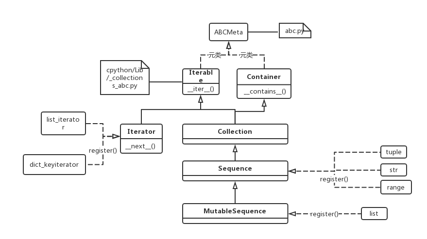

Sequence
=================
In python3, There are three basic sequence types: lists, tuples, and range objects.

抽象基类Sequence
------------------
在python3中确实有class Sequence的定义, 位于文件 `cpython/Lib/_collections_abc.py <https://github.com/python/cpython/blob/3.7/Lib/_collections_abc.py>`_, 并且是抽象基类(abstract base class, abc)

从上面的UML图可得：

1. list, tuple, range都是iterable，可以用于“for loop"
2. Iterator, Iterable, Sequence都是抽象基类(abstract base class, abc)

Features
-------------
1. ordered

record element position or order of insertion. support indexing, slicing, or other sequence-like behavior.